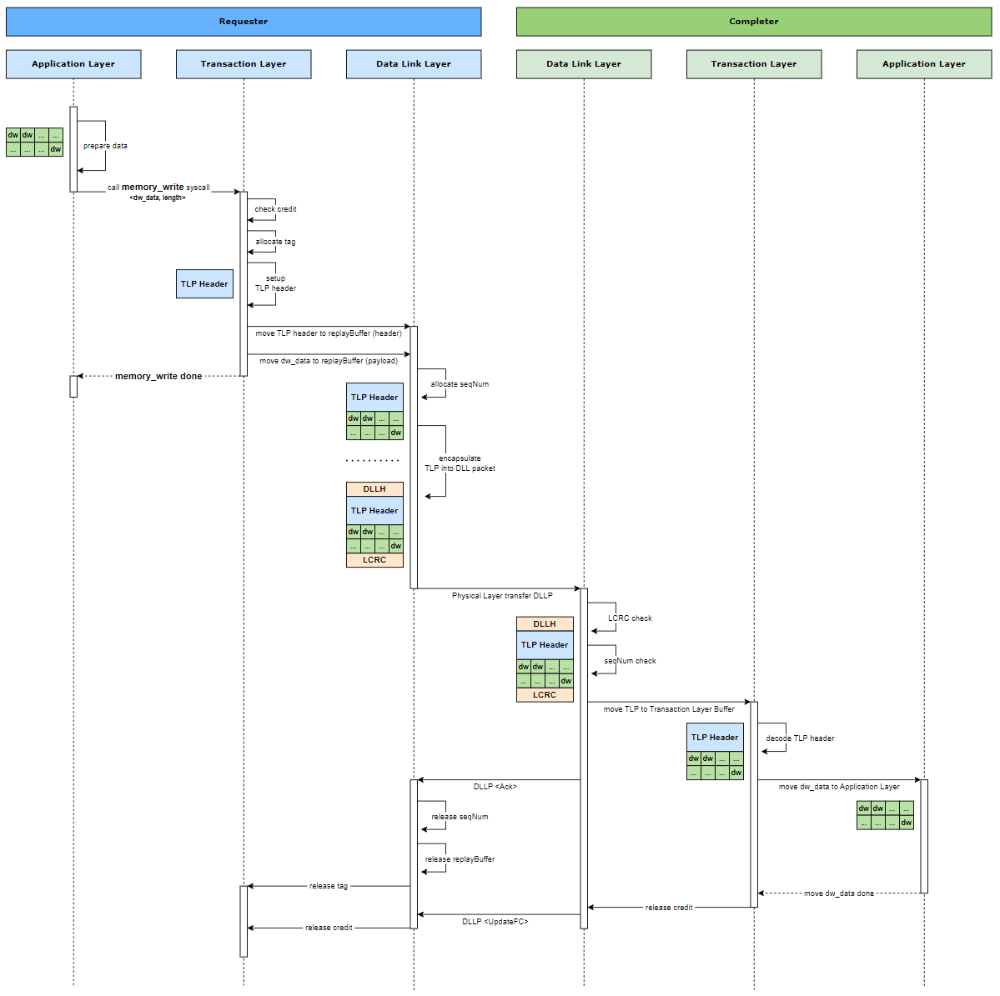
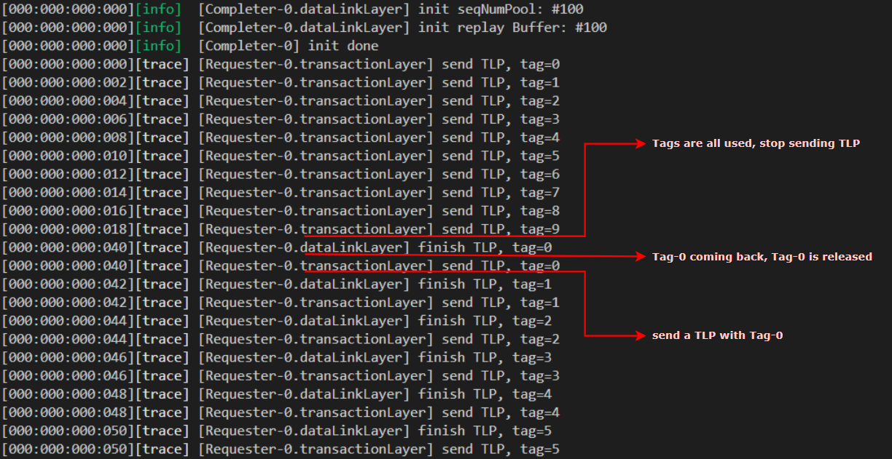

# PCIe System TLM2.0 Simulator
This project implement a system simulation model including PCIe.

## Simulator Information
### Version
v2.1
### Component Diagram

### New Features
1. Introduce PCIe hierachy
   - Application Layer
     - profile (new)
   - Transaction Layer
     - send TLP
     - tag management
     - credit management
     - internal buffer management (new)
   - Data Link Layer
     - send DLLP[AckNack]
     - send DLLP[UpdateFC] (new)
     - seqNum management
     - replay buffer[header, payload]

#### Write Flow Flow Diagram


#### Simulater Output


#### TLM2.0 4-way handshake

 
## Compile and Run
```
make
./_sim
```
