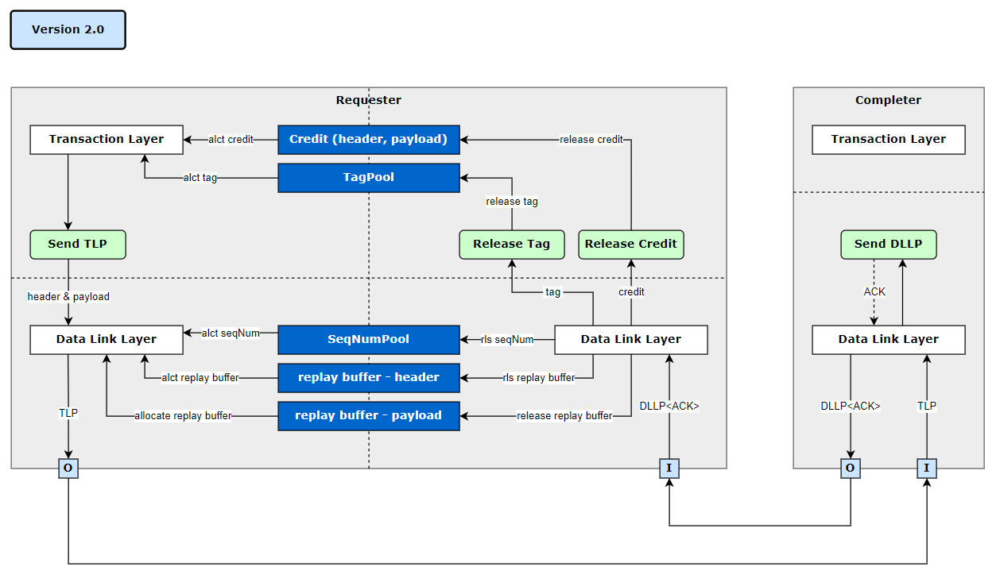

# PCIe System TLM2.0 Simulator
This project implement a system simulation model including PCIe.

## Simulator Information
### Version
v1.1
### Component Diagram

### Features
* **initiator**
  * sending TLM_payload to pcie-bus (fw_if_0) and wait for response (bw_if_0)
* **pcie bus**
  * receiving TLM_payload from initiator (fw_if_0)
  * perform delay (peq)
  * sending TLM_payload to target (fw_if_1) and wait for response (bw_if_0)
* **target**
  * receiving TLM_payload from pcie-bus (fw_if_1)
  * perform delay (peq)
  * sending TLM_response back to pcie-bus (bw_if_0)
 
## Compile and Run
```
make
./_sim
```
