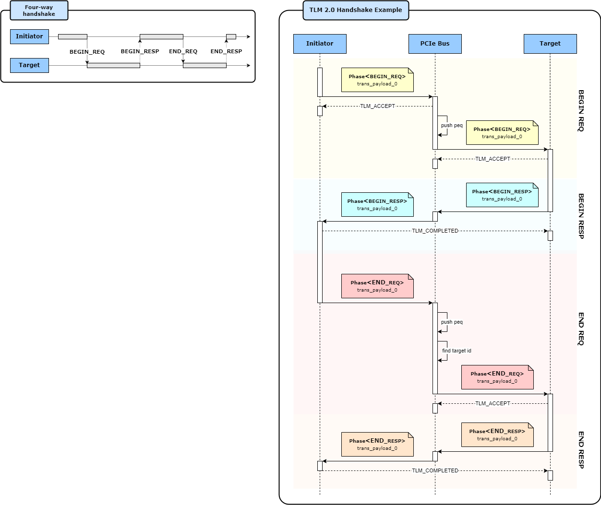

# PCIe System TLM2.0 Simulator
This project implement a system simulation model including PCIe.

## Simulator Information
### Version
v1.4
### Component Diagram

### New Features
1. Support multiple initiators added in system

#### TLM2.0 4-way handshake

 
## Compile and Run
```
make
./_sim
```
