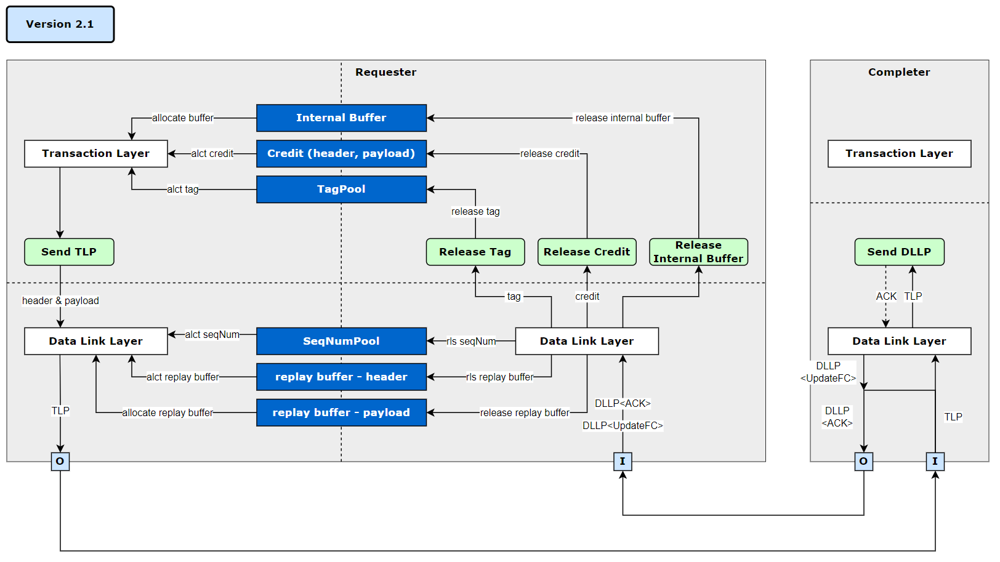

# PCIe System TLM2.0 Simulator
This project implement a system simulation model including PCIe.

## Simulator Information
### Version
v1.0
### Component Diagram

### Features
* **initiator**
  * sending TLM_payload to taget
* **target**
  * receiving TLM_payload from target 
 
## Compile and Run
```
make
./_sim
```
